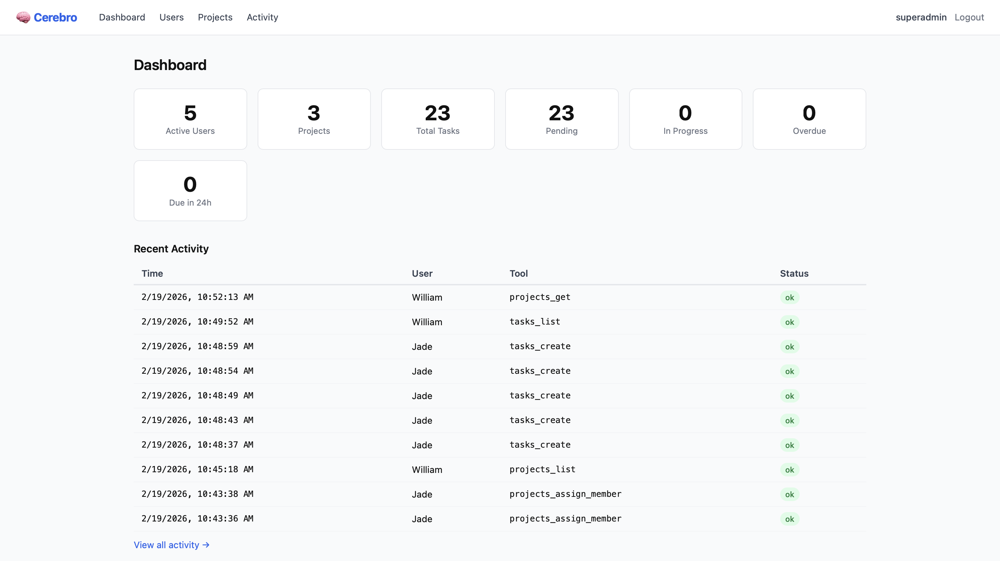

# 🧠 Cerebro

```
  ██████╗███████╗██████╗ ███████╗██████╗ ██████╗  ██████╗
 ██╔════╝██╔════╝██╔══██╗██╔════╝██╔══██╗██╔══██╗██╔═══██╗
 ██║     █████╗  ██████╔╝█████╗  ██████╔╝██████╔╝██║   ██║
 ██║     ██╔══╝  ██╔══██╗██╔══╝  ██╔══██╗██╔══██╗██║   ██║
 ╚██████╗███████╗██║  ██║███████╗██████╔╝██║  ██║╚██████╔╝
  ╚═════╝╚══════╝╚═╝  ╚═╝╚══════╝╚═════╝ ╚═╝  ╚═╝ ╚═════╝

         MCP Task Manager — Connect your team's AI's
```

> Team-based task management with MCP integration — connect your Claude AI to track and manage tasks across your organization.

Cerebro is a production-ready task management server that exposes a standardized [Model Context Protocol (MCP)](https://modelcontextprotocol.io) interface. Teams can connect their Claude AI instances to track tasks across projects, with support for multiple users and role-based access. Includes a modern admin dashboard for oversight.

**Use cases:** Track tasks across a company or project team, give each team member's AI assistant access to shared task data, manage cross-user workflows.



## What is Cerebro?

Cerebro is a task management server that exposes a standardized MCP interface, allowing AI agents to create, track, and manage tasks through a clean REST API. It includes a modern admin dashboard for manual oversight.

## Deployment

Cerebro is very easy to deploy to [Railway](https://railway.app) and will cost less than **$5/month** to run. Simply connect this repo and Railway will handle the rest.

> **Note:** You need a dedicated public URL for the MCP OAuth flow to work. You cannot test it locally with Claude without running Claude in [developer/MCP dev mode](https://modelcontextprotocol.io/docs/tools/inspector).

You can also easily deploy with Railway templates with this button below:

[](https://railway.com/deploy/w-L8xJ?referralCode=WbXk0b&utm_medium=integration&utm_source=template&utm_campaign=generic)

## Quick Setup

```bash
# Install dependencies
bun install

# Set up environment
cp .env.example .env
# Edit .env with your database credentials

# Start the server
bun start
# or
bun run dev
```

The server runs on `http://localhost:3000` by default.

## Tech Stack

- **Runtime**: Bun
- **Framework**: Hono
- **Database**: SQLite (For Dev) | PostgreSQL (For Prod)
- **MCP SDK**: @modelcontextprotocol/sdk

## License

MIT
